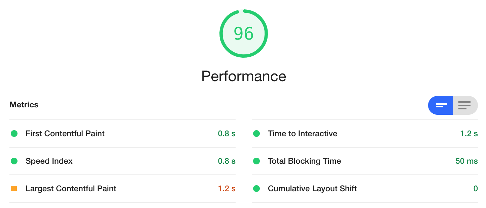
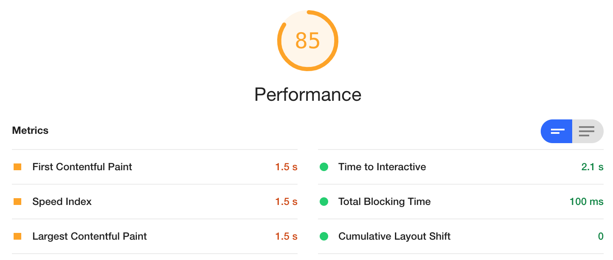
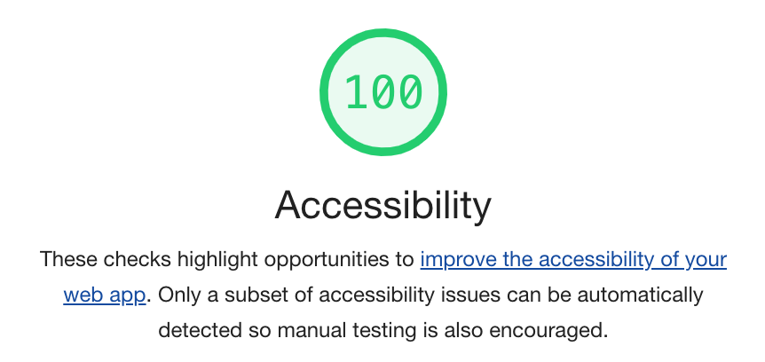

# Contact Management

### Info

- September 24, 2020
- React application that shows contact information from the server. The user is able to add new contacts, edit and delete existing contact.

### Setup

1. `npm install` to install dependencies
2. `node server` to run server. Server will run in `localhost:3001`
3. `npm run dev` to run React App (in another terminal window). React app will run in `localhost:1234`

### Creating the React app

1. React app was setup manually.
2. State management: React Context.
3. React app is using functional components with hooks.
4. Bundler: Parcel
5. CSS: Bootstrap

### Requirements

1. ✅ Display the contacts in a table or list.
2. ✅ Allow the user to delete an existing contact.
3. ✅ Allow the user to update an existing contact.
4. ✅ Allow the user to create a new contact.
5. ✅ Add a README file.

### Notes

- I used Bootstrap because my focus wasn't on design.
- The app is responsive for desktops and phones
- Tested performance using Dev Tool Lighthouse
  - Production 
  - Dev 
- Tested accesability using Dev Tool Lighthouse
  - Production and Dev 
- Future improvements:
  - Abstract fetch logic in ContactProvider.js to make it DRY
  - Create a form component to use in AddContact and EditContact
  - Use Jest to create tests
